# Graph Structure Helps: Spatio-Temporal GNNs for PM₂.₅ Forecasting in Kolkata

Hourly ground-level **PM₂.₅ forecasting (1–24 h ahead)** across a **7-station
Kolkata network**, fusing CPCB ground sensors with **satellite AOD** and
**night-time lights** (a human-activity proxy) over a dynamic, wind-conditioned
graph. The study compares a graph-attention **GNN-LSTM**, a recurrence-free
**Pure-STGNN**, and strong non-graph baselines under a strictly unseen,
all-season, all-station test split.

- 📄 Paper draft (IEEE 2-column): [`paper/paper.tex`](paper/paper.tex)
- 🧪 Methodology & plan: [`plan.md`](plan.md)
- 📊 Auto-generated metrics: [`results/RESULTS.md`](results/RESULTS.md) · curated discussion: [`results/FINDINGS.md`](results/FINDINGS.md)
- 🛰️ Satellite download scripts (GEE): [`satellite_scripts/`](satellite_scripts/)

---

## 1. Dataset

| Property | Value |
|---|---|
| Stations (graph nodes) | 7 — Ballygunge, Bidhannagar, Fort William, Jadavpur, Rabindra Bharati, Rabindra Sarobar, Victoria Memorial |
| Period | 2024-01-01 → 2026-03-31, **hourly** |
| Records | 137,928 (19,704 timestamps × 7 stations) |
| Spatial extent | all stations within **15.4 km** (intra-urban) |
| Target | `Ground_PM2.5` (CPCB), **23.7 % missing** |
| Predictors | satellite PM, AOD, night-light, temperature, RH, wind (u,v), PBLH, rainfall, cloud + cyclical time encodings (22 features/node) |

**Key data facts that shape the model**

- **Seasonality:** winter mean **79.9** vs monsoon **20.1 µg/m³** (≈4× swing).
- **Diurnal:** night peak, afternoon trough (boundary-layer cycle).
- **Satellite bias:** satellite over-predicts ground by **+11.2 µg/m³** (MAE 20.9, RMSE 33.4, r 0.76) → motivates learned correction.
- **Correlations with PM₂.₅:** satellite PM +0.76, temperature −0.64, wind dir −0.51, cloud −0.45, AOD +0.25, night-light +0.20.

---

## 2. Exploratory data analysis

### Annual cycle
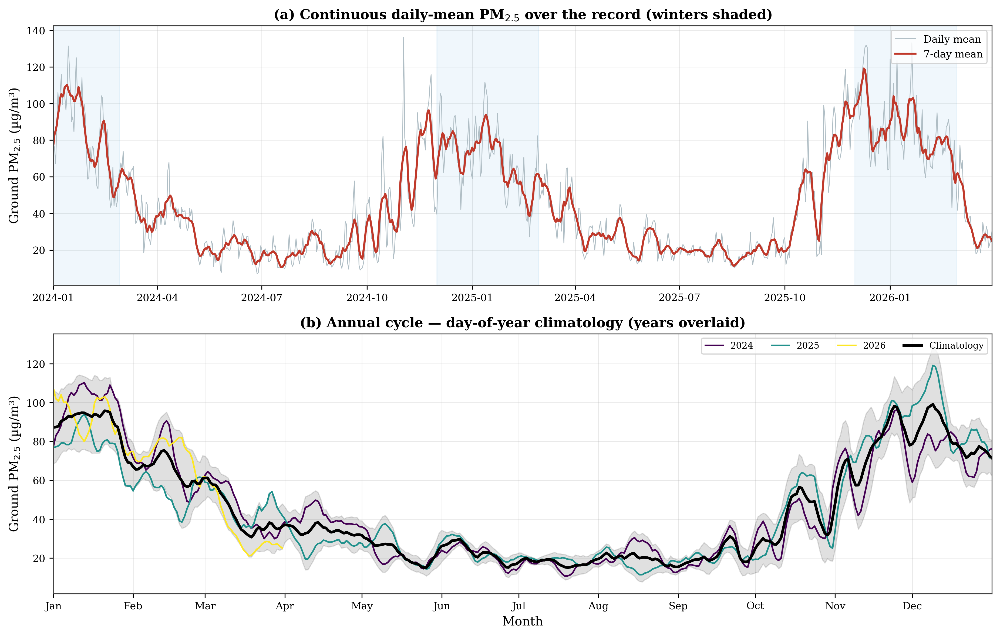
*Continuous daily-mean series (winters shaded) and the day-of-year climatology with each year overlaid — the 4× winter→monsoon swing recurs annually.*

### Seasonality and diurnal cycle
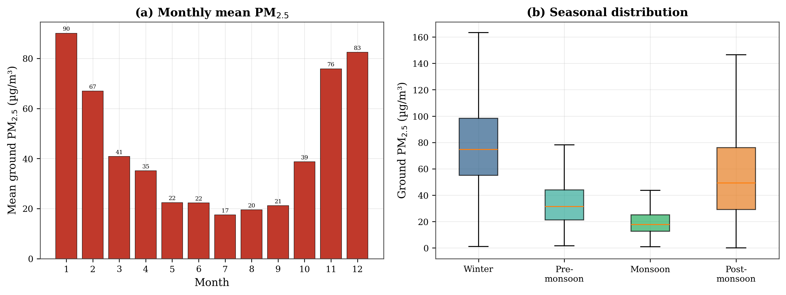
*Monthly means and seasonal distributions of ground PM₂.₅.*

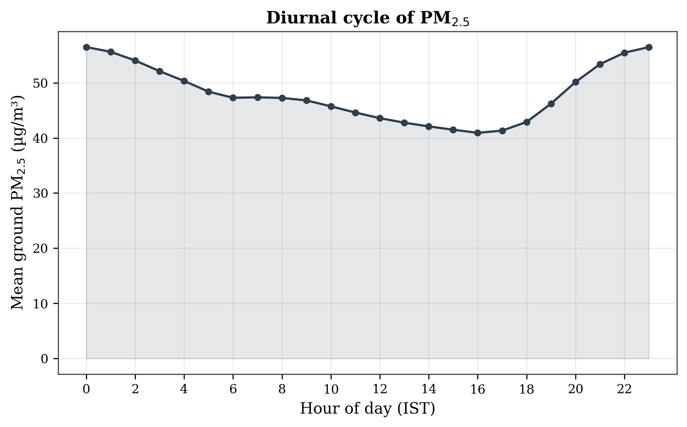
*Night-time maximum, afternoon minimum — driven by the planetary boundary layer.*

### Satellite vs ground (bias motivation)
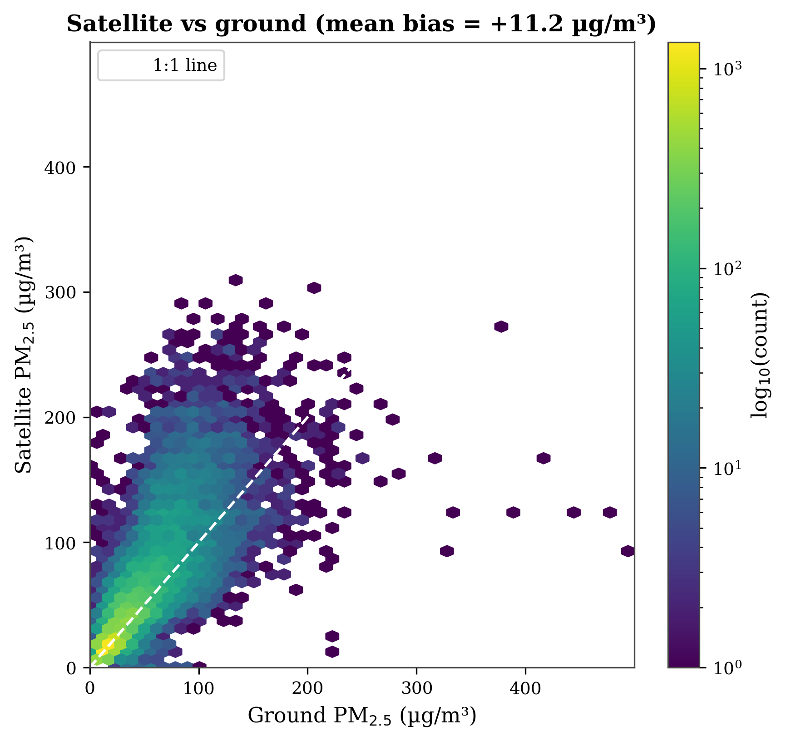
*The satellite estimate is informative (r 0.76) but systematically high (+11.2 µg/m³) → a learnable correction target.*

### Spatio-temporal drivers (contour)
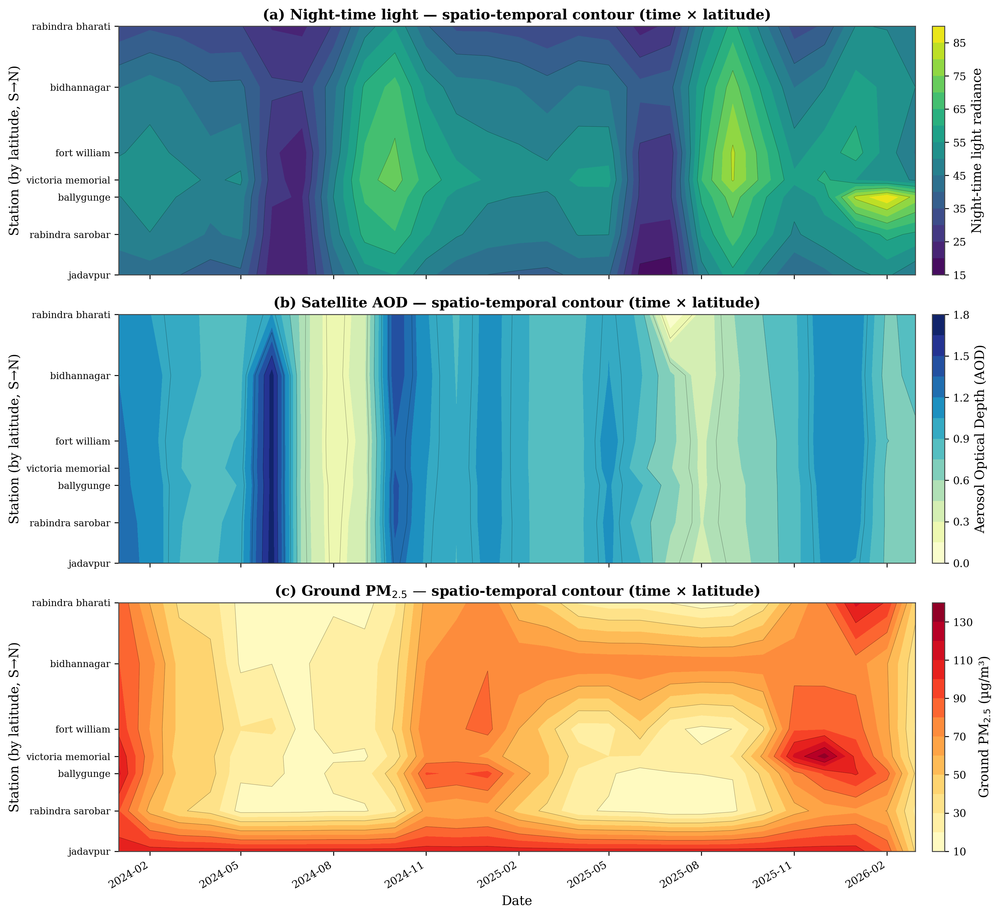
*Time × station-latitude contours of (a) night-light, (b) satellite AOD, (c) ground PM₂.₅. AOD and PM₂.₅ share the winter-high/monsoon-low pattern; dark bands in (a) are monsoon night-light retrieval dips.*

### Daily spatial evolution
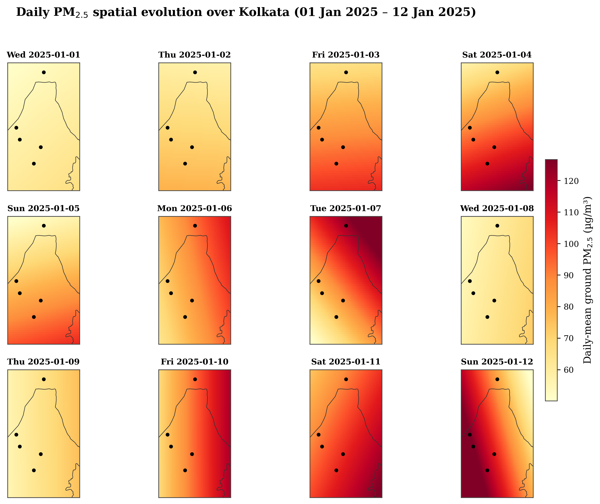
*Interpolated daily-mean PM₂.₅ field over Kolkata for a 12-day winter window.*

### Spatio-temporal EOF / PCA decomposition
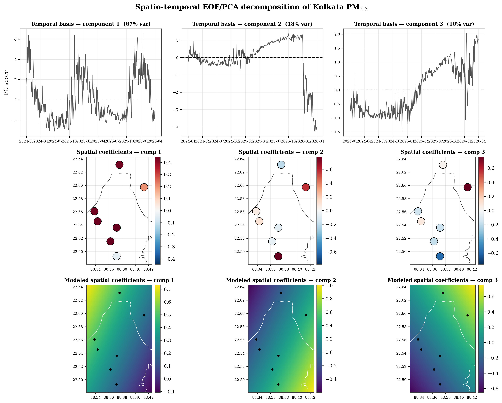
*Temporal basis + spatial coefficients + modeled coefficient maps. Component 1 (≈67 % variance) is the city-wide seasonal mode; components 2–3 are spatial gradients.*

### Monthly satellite fields (from Google Earth Engine inputs)
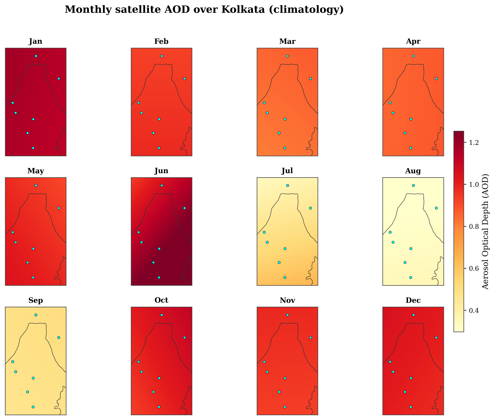
*Monthly MODIS-MAIAC AOD climatology over Kolkata (high winter, low monsoon).*

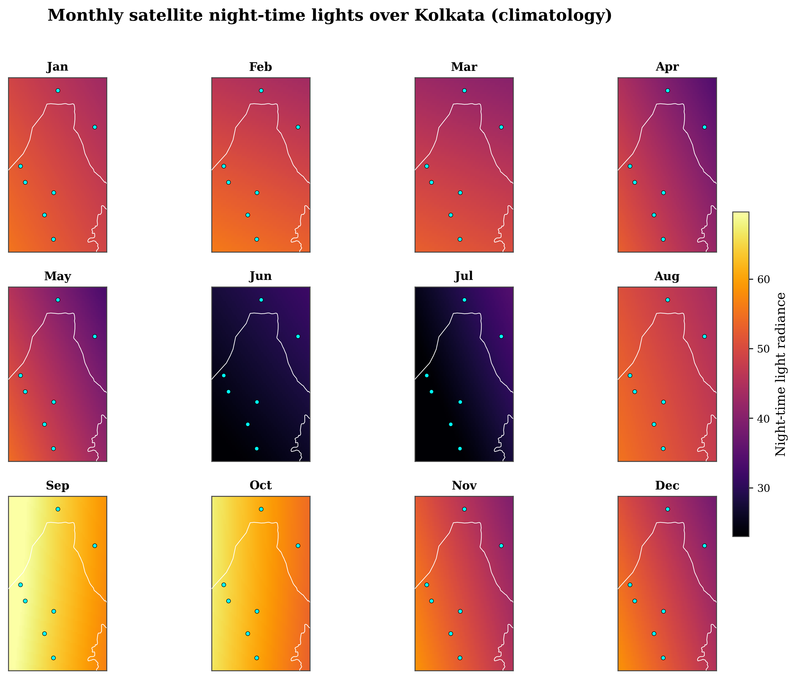
*Monthly VIIRS night-light climatology — note the monsoon (Jun–Jul) retrieval dip under cloud.*

---

## 3. Model

A dynamic, directed, **wind-conditioned graph** couples the 7 stations
(edge weight = inverse-distance × wind-alignment). A **graph-attention spatial
encoder** is paired with a temporal encoder; we study a **GNN-LSTM** hybrid and a
recurrence-free **Pure-STGNN** (temporal graph attention, no LSTM).

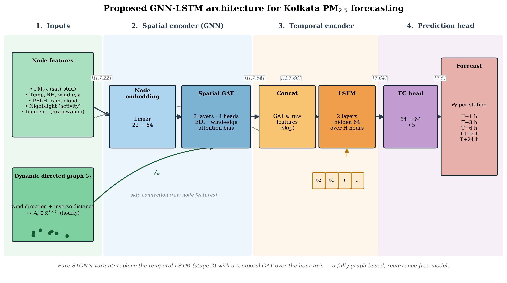
*Inputs → dynamic graph Gₜ → spatial GAT → skip-concat → temporal LSTM → FC head → 1–24 h forecasts. The Pure-STGNN variant replaces the LSTM with a temporal GAT.*

- History window **H = 24 h**; horizons **T+{1,3,6,12,24} h**.
- **Masked Huber loss** (targets never imputed; 23.7 % missing handled by masking).
- **Block split** (15-day blocks cycled 60/20/20): a window joins a split only if its *entire* input+horizon span lies in it → the **test set is strictly unseen and covers all 7 stations and all 4 seasons** (`results/split_summary.json`).

---

## 4. Results

> Strictly unseen test set: 3,347 windows, all stations, all seasons.

### 4.1 Overall comparison (all horizons pooled)

| Model | MAE | RMSE | MAPE (%) | R² | IA |
|---|---|---|---|---|---|
| Persistence | 11.13 | 18.98 | 31.4 | 0.670 | 0.911 |
| HistGBR | **9.46** | 15.14 | 33.8 | 0.790 | **0.942** |
| LSTM (no graph) | 10.40 | 15.57 | 37.8 | 0.778 | 0.936 |
| Pure-STGNN | 9.88 | 15.19 | 36.7 | 0.789 | 0.936 |
| **GNN-LSTM** | 9.92 | **15.08** | 33.3 | **0.791** | 0.941 |

**Takeaway:** both graph models beat the graph-free LSTM on every metric →
**spatial graph structure (not the recurrent cell) drives the gain.** GNN-LSTM is
best on RMSE/R²; gradient-boosted trees stay competitive on pooled MAE.

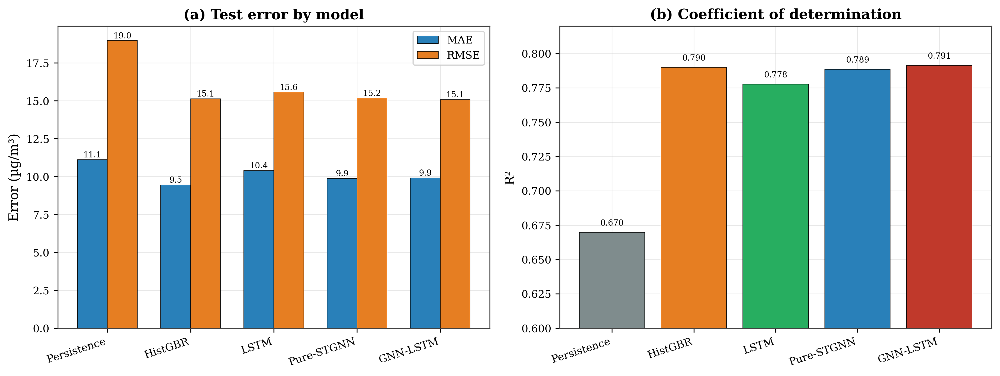

### 4.2 Error vs forecast horizon

The graph models degrade most gracefully and **win at the longer horizons
(T+12, T+24)** where local autoregression decays.

| Metric | T+1 | T+3 | T+6 | T+12 | T+24 |
|---|---|---|---|---|---|
| MAE | 6.46 | 8.27 | 10.39 | 11.89 | 12.60 |
| RMSE | 9.75 | 12.85 | 15.72 | 17.28 | 18.21 |
| R² | 0.912 | 0.848 | 0.774 | 0.728 | 0.699 |
| Recall (%) | 78.6 | 70.1 | 60.6 | 59.6 | 60.4 |
| False alarm (%) | 1.7 | 2.4 | 3.0 | 3.8 | 3.8 |

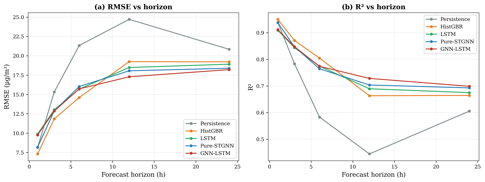

### 4.3 Station-wise (GNN-LSTM)

| Station | MAE | RMSE | R² | IA | n |
|---|---|---|---|---|---|
| Ballygunge | 11.32 | 17.13 | 0.789 | 0.941 | 14,614 |
| Bidhannagar | 10.73 | 14.80 | 0.784 | 0.936 | 8,976 |
| Fort William | 10.01 | 14.61 | 0.768 | 0.934 | 15,297 |
| Jadavpur | 18.30 | 26.61 | 0.706 | 0.904 | 2,623 |
| Rabindra Bharati | 9.66 | 16.15 | 0.776 | 0.937 | 16,081 |
| Rabindra Sarobar | **7.89** | **10.89** | 0.802 | **0.947** | 16,521 |
| Victoria Memorial | 9.06 | 13.56 | **0.808** | 0.944 | 15,375 |

*Jadavpur is hardest — it has by far the fewest ground labels; message passing partially compensates.*

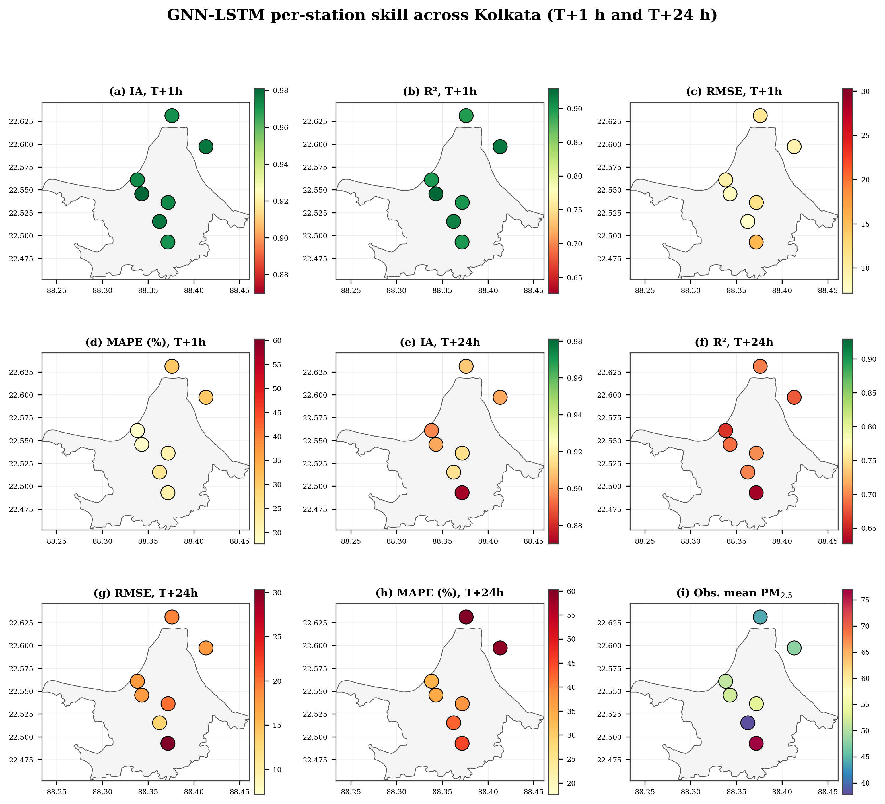
*Per-station IA / R² / RMSE / MAPE at T+1 and T+24, plus observed mean PM₂.₅, on the Kolkata boundary.*

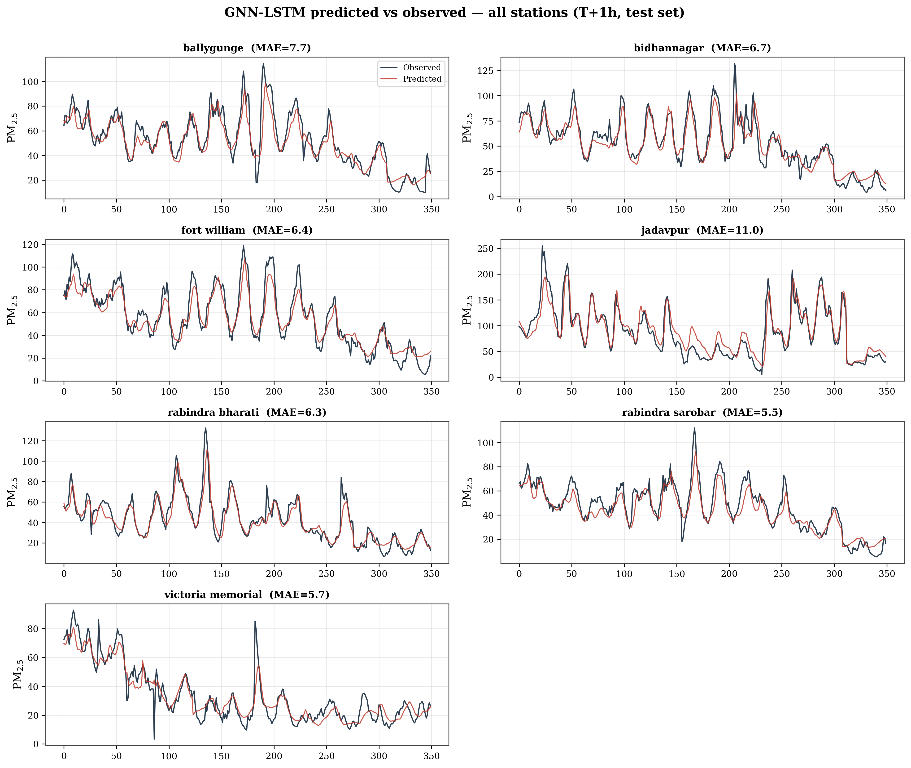
*One-hour-ahead forecasts vs observations for all seven stations (test set).*

### 4.4 Season-wise (GNN-LSTM)

| Season | MAE | RMSE | R² | IA | n |
|---|---|---|---|---|---|
| Winter | 16.32 | 23.16 | 0.515 | 0.834 | 18,651 |
| Pre-monsoon | 8.52 | 11.95 | 0.671 | 0.893 | 34,560 |
| Monsoon | **5.02** | **8.00** | 0.504 | 0.805 | 19,446 |
| Post-monsoon | 11.38 | 15.75 | **0.689** | **0.901** | 16,830 |

*Easiest in the clean monsoon, hardest in high-variance winter.*

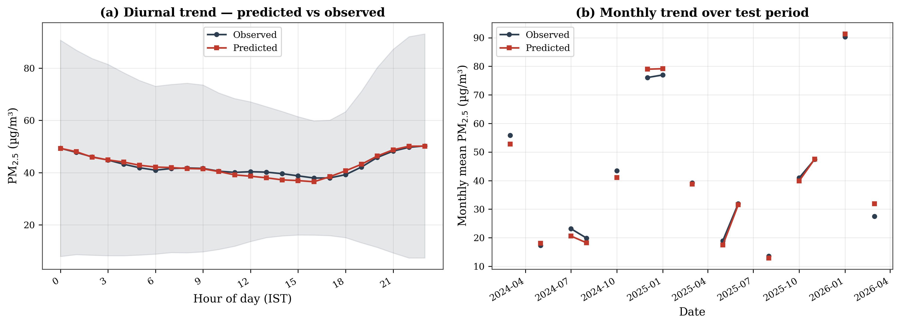
*Predicted vs observed diurnal and monthly trends.*

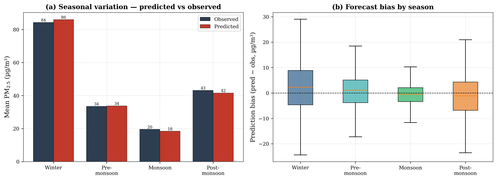
*Predicted vs observed seasonal means and per-season forecast bias (centred near zero).*

---

## 5. Repository structure

```
models/                 model + pipeline code
  config.py             hyperparameters & paths
  data.py               panel build, features, dynamic wind graph, block split
  model.py              DenseGAT, GNN-LSTM, Pure-STGNN, LSTM-only, masked loss
  engine.py             training, prediction collection, metrics
  baselines.py          persistence + HistGradientBoosting
run.py                  ENTRY POINT — trains all models, evaluates, writes results
visualizations/
  visualize.py          regenerates every figure (PNG, 300 dpi)
  *.png                 the figures shown above
satellite_scripts/      Google Earth Engine scripts (VIIRS night-lights, MODIS AOD) + plotter
paper/                  IEEE LaTeX paper (paper.tex) + build notes
results/                metrics.json, RESULTS.md, FINDINGS.md, predictions, checkpoints
geodata/kolkata.geojson Kolkata Municipal Corporation boundary (OSM/Nominatim)
_analyze.py             standalone EDA statistics
```

## 6. Reproduce

```bash
python run.py                      # train all models, write results/
python -m visualizations.visualize # regenerate all figures
```
Dependencies (already present): `torch`, `numpy`, `pandas`, `scikit-learn`,
`scipy`, `matplotlib`, `geopandas`. No `torch_geometric` needed — the GAT layer
is implemented densely (7-node graph).

## 7. Models compared
`Persistence` · `HistGBR` · `LSTM` (no graph) · `Pure-STGNN` (GAT space + GAT
time, no LSTM) · `GNN-LSTM` (GAT space + LSTM time). Both graph models beat the
graph-free LSTM, isolating the spatial graph as the source of the improvement.

## 8. Acknowledgements
Ground PM₂.₅ from the **Central Pollution Control Board (CPCB)**, India; satellite
**AOD (MODIS MAIAC)** and **night-time lights (VIIRS)** via **Google Earth
Engine**. AI assistance (Anthropic Claude / Claude Code) was used for code and
drafting support; all analysis and conclusions were verified by the authors.
